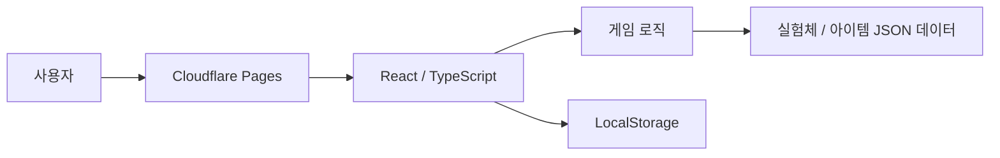

# wordlER

이터널 리턴의 실험체와 아이템을 대상으로 하는 Wordle 스타일의 추리 게임입니다.

추측한 대상과 정답의 속성을 비교해 제공되는 힌트를 바탕으로 제한된 횟수 안에 정답을 맞히는 방식입니다.

배포 이후 약 1.4k의 누적 방문자를 기록했습니다.(26.09.22 기준)
실제 사용자 피드백을 바탕으로 버그와 예외 케이스를 수정하고, 게임 모드를 추가하며 기능을 확장했습니다.

## 기술 스택

**Frontend**


**Deploy**


## 시스템 구조



별도의 백엔드 없이 프론트에서 로직을 처리합니다.

실험체와 아이템 데이터는 정적 JSON으로 관리하며, 플레이 기록과 통계는 브라우저 `localStorage`에 저장합니다.

## 실행

Node.js 환경에서 실행합니다.

```bash
npm install
npm run dev
```

테스트 및 프로덕션 빌드는 다음 명령으로 확인할 수 있습니다.

```bash
npm test
npm run build
```

## Disclaimer

이 프로젝트는 이터널 리턴을 기반으로 제작한 비공식 팬 프로젝트입니다.

Eternal Return 및 관련 캐릭터, 아이템, 이미지 등의 지적재산권은 **Nimble Neuron** 및 각 권리자에게 있습니다.

프로젝트에서 사용하는 **Pretendard** 폰트는 SIL Open Font License 1.1에 따라 사용됩니다.  
라이선스 전문은 [`public/fonts/LICENSE.txt`](public/fonts/LICENSE.txt)에서 확인할 수 있습니다.
